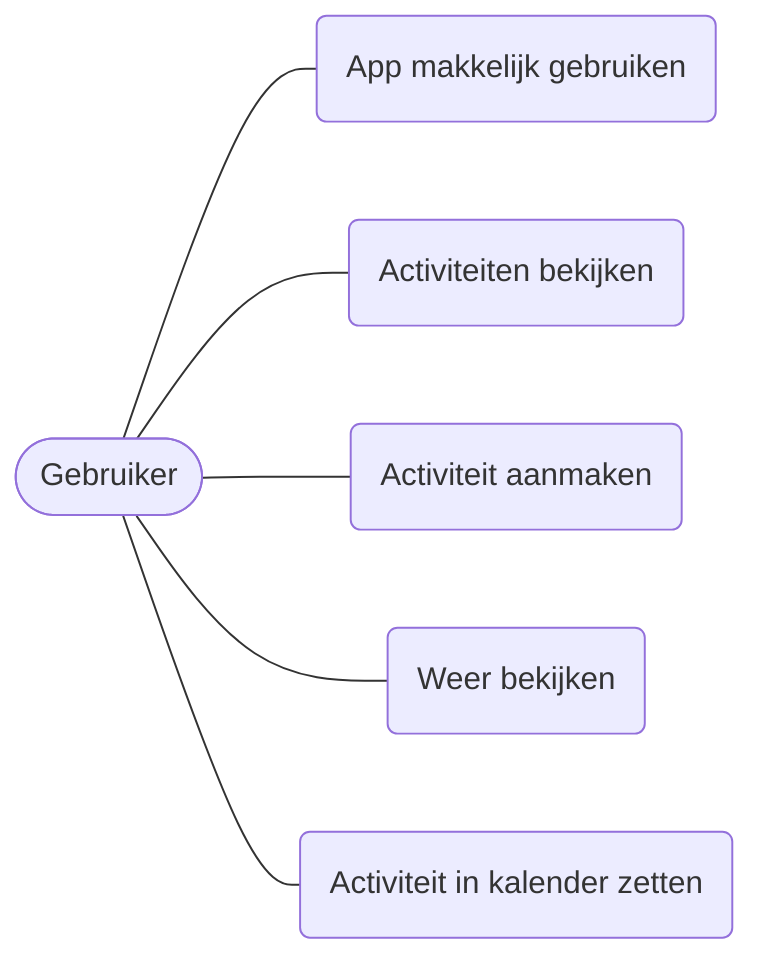

# Use case diagram

```mermaid
flowchart LR
    Gebruiker([Gebruiker])

    UC1(App makkelijk gebruiken)
    UC2(Activiteiten bekijken)
    UC3(Activiteit aanmaken)
    UC4(Weer bekijken)
    UC5(Activiteit in kalender zetten)

    Gebruiker --- UC1
    Gebruiker --- UC2
    Gebruiker --- UC3
    Gebruiker --- UC4
    Gebruiker --- UC5
```
